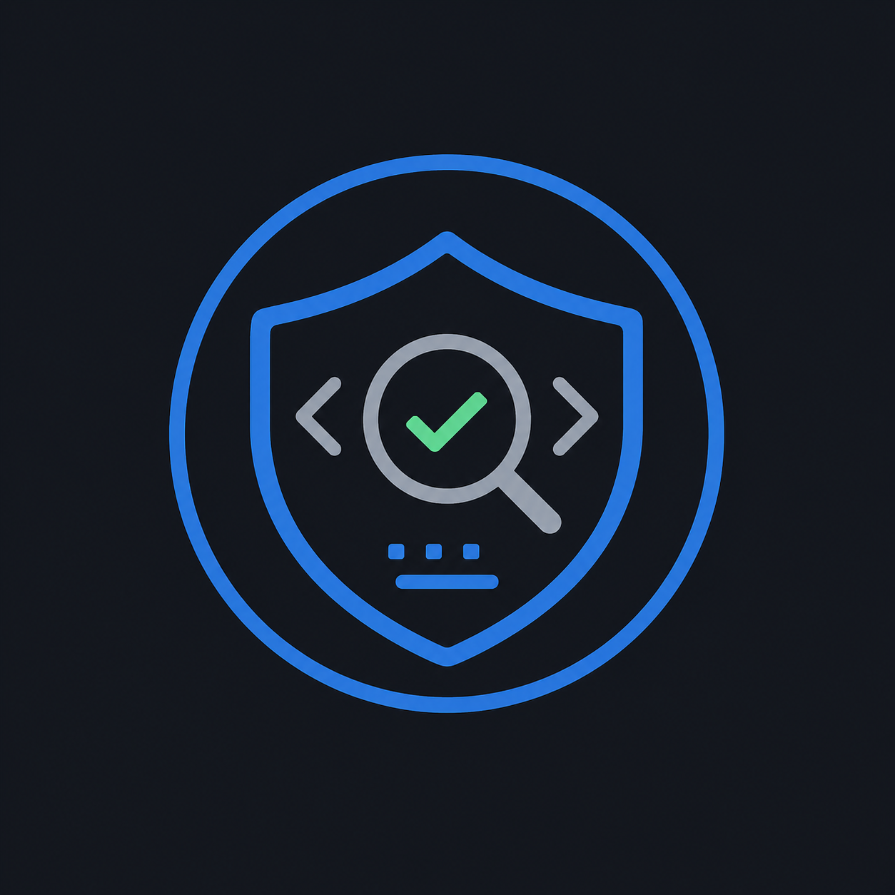

# Assumption Checkpoint

<p align="center">
  
</p>

`assumption-checkpoint` is a Codex skill for safer coding decisions. It makes the agent pause before confident actions, choose a risk level, and check the nearest reliable evidence first.

Use it when debugging, changing code, reviewing code, explaining unfamiliar code, or making implementation decisions where hidden assumptions can cause mistakes.

## How It Works

The skill adds lightweight checkpoints at risky moments:

- before narrowing a broad or multi-part request into one theory;
- before stating a root cause;
- before making a review finding or choosing an implementation direction;
- before editing code based on a mental model;
- before calling a change complete.

The skill now starts from four outcome invariants:

- confident claims name concrete evidence;
- behavior-changing edits stay scoped to evidence;
- weak, contradicted, or unresolved theories get more evidence, narrower scope, audit, or a user decision;
- completion claims require concrete verification or an explicit verification limit.

It uses a compact risk router:

- `assumption-checkpoint:low` for mechanical edits that cannot change runtime behavior;
- `assumption-checkpoint:normal` for ordinary debugging, code changes, reviews, explanations, and implementation decisions;
- `assumption-checkpoint:high` for ambiguous, shared, high-risk, visual, integration, or behavior-changing work.

Each normal checkpoint answers:

```text
Assumption:
Outcome covered:
Evidence checked:
Theory strength: Strong enough / Weak / Contradicted / Unresolved
Remaining risk:
Next verification:
```

For low-risk mechanical edits, it can use a shorter form: assumption plus verification.

The checkpoint is primarily an internal agent discipline, not a transcript format. The agent should surface full checkpoints only when they affect trust, risk, scope, expectations, verification limits, or a user decision. High checkpoints are mandatory as discipline, but routine high checkpoints can be surfaced as short summaries instead of full templates.

The skill classifies each theory as strong enough, weak, contradicted, or unresolved before confident action. Weak or unresolved theories require one more independent check, a clean-context evidence audit when uncertainty justifies the overhead, or a user decision when the missing evidence is about intended behavior or scope.

Before narrowing a theory, the agent locks the user-visible outcome. Multi-part requests are split into observable invariants so a theory can explain one part of the task without quietly replacing the whole task.

User-selected levels are treated as the minimum strictness level. The agent may escalate to `high`, but must not downgrade.

When `high` uses an independent evidence audit, the agent passes the high checkpoint fields to a clean-context reviewer so it can test both the confirming and contradicting signals and look for alternative theories. Audits are used only when the environment and user permissions allow them; otherwise the agent performs another independent local check. Audits do not bypass the theory strength gate.

## What It Helps With

- Separates facts from guesses before confident claims, findings, decisions, or code changes.
- Forces evidence from tests, logs, stack traces, callers, callees, docs, UI observations, acceptance criteria, or git history.
- Classifies theory strength before action instead of treating evidence as a vague note.
- Names what would confirm and what would contradict high-risk theories.
- Lets clean-context audits challenge high-risk theories using the same confirming and contradicting signals.
- Escalates risky or ambiguous theories to independent evidence audit when local checking is not enough.
- Keeps edits scoped to what the evidence supports.
- Keeps narrowed theories tied to the full user-visible outcome.
- Uses task cards for debugging, review, explanation, implementation, and completion.
- Defines verification before implementation.
- Prevents “looks fixed” claims when tests or checks were not actually run.
- Reduces performative checkpoints by requiring concrete sources and useful next verification.

## Mini Docs

- [Purpose](docs/purpose.md)
- [How It Works](docs/how-it-works.md)
- [Installation](docs/installation.md)
- [Limitations](docs/limitations.md)

## Gemini CLI Extension

This repository can also be installed as a Gemini CLI extension:

```bash
gemini extensions install https://github.com/alexandrershov/assumption-checkpoint-skill
```

The extension bundles the skill at `skills/assumption-checkpoint/SKILL.md`.

## Claude Code Plugin

This repository can also be used as a Claude Code plugin:

```bash
claude --plugin-dir .
```

After it is pushed to GitHub, it can be added as a Claude Code marketplace:

```text
/plugin marketplace add alexandrershov/assumption-checkpoint-skill
/plugin install assumption-checkpoint@assumption-checkpoint
```

## Cursor Plugin

This repository also includes Cursor plugin metadata:

```text
.cursor-plugin/marketplace.json
cursor-plugin/.cursor-plugin/plugin.json
```

For project-level Cursor usage, copy or keep the included rule:

```text
.cursor/rules/assumption-checkpoint.mdc
```

If the plugin is published to the Cursor Marketplace, it can be installed from Cursor with `/add-plugin`.

## Skill Files

- `assumption-checkpoint/SKILL.md` contains the workflow and rules.
- `skills/assumption-checkpoint/SKILL.md` bundles the same skill for Gemini CLI extension installs.
- `.claude-plugin/plugin.json` makes the repository usable as a Claude Code plugin.
- `.claude-plugin/marketplace.json` lets Claude Code discover the plugin through a marketplace.
- `.cursor-plugin/marketplace.json` lists the Cursor plugin for marketplace publishing.
- `cursor-plugin/.cursor-plugin/plugin.json` makes the Cursor plugin package.
- `.cursor/rules/assumption-checkpoint.mdc` provides a Cursor project-rule fallback.
- `assumption-checkpoint/agents/openai.yaml` defines the OpenAI-facing display name, prompt, and automatic invocation policy.
- `scripts/check-sync.sh` verifies bundled skill and Cursor rule copies are synchronized.
- `docs/evals/assumption-checkpoint-scenarios.md` contains pressure scenarios for A/B testing skill behavior.

## Validation

```bash
npm run check:sync
```

This checks that the canonical skill, Gemini/Claude/Cursor bundled skill copies, and Cursor rule copies are synchronized.

## Default Prompt

```text
Use $assumption-checkpoint while diagnosing bugs, changing code, reviewing code, explaining unfamiliar code, making implementation decisions, or calling work complete so early confidence becomes checked evidence.
```
